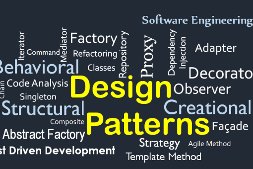

## The Most Important Invention: the Wheel

Imagine you’re a nomad back during the dawn of humanity and civilization. You’re traveling the world and need to transport items with you. Way back then, the only way to transport objects would be to carry them on your two hands and walk with your two feet to your destination. The work is time-consuming, inefficient, and very strenuous for your body, but you can’t complain as there’s no other solution. 

Luckily for you, someone has learned how to domesticate animals, and now they can do the heavy lifting for you. Gone are the days of having to carry everything by yourself. You can now have a camel do all the heavy lifting. But with this new solution comes another set of issues. Now you have to take care of the animal and provide it with plenty of food and water. During this time period, food and water were not as accessible as in today’s society. Especially since you’re working your animals to the bone in transporting your items, they require more of your precious food and water.

Thankfully, the ultimate invention was just created in the 4th millennium BC by the Mesopotamians: the wheel. With the wheel, heavier and more abundant items can be transferred with ease, requiring less effort and energy to do so. Now in modern society, when things need to be transferred from one place to another, the wheel is essential in designing new cars, hand trucks, luggage carts, etc. 

## Coders are Lazy

Like the wheel, design patterns do essentially the same thing; they provide a solution to recurring problems in software development and work as a template for solving said issue. They also make things a little bit easier and more efficient for software developers, who are notoriously lazy.

In my case, it makes developing my current project: [Ohana Scholars](https://ohana-scholars.github.io/), a web-based study session scheduler, easier for my team and me. We make use of Meteor’s reactivity (which is similar to the Observer design pattern) to update pages easier. When our users or admins manipulate the various collections in our application by adding or removing data, the meteor automatically updates the page with new information, even without a full refresh to the page. This makes development easier and more convenient for us as we don’t have to do the heavy lifting of manually updating the pages with the new information.
