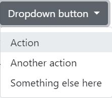

For the past few weeks, I’ve dabbled in using a UI Framework, specifically Bootstrap 5. At the start, I thought it was highly unnecessary and a waste of time to learn. Even after the pain of first learning HTML and CSS, I thought Bootstrap 5 was much more complicated and much preferred to use HTML and CSS. However, I was very wrong. The more I familiarized myself with how Bootstrap 5 works and its documentation, it was MUCH easier than raw HTML and CSS.

Let’s compare making a dropdown menu in Bootstrap 5 and raw HTML and CSS.

*Both examples were taken from the [Bootstrap 5](https://getbootstrap.com/docs/5.0/components/dropdowns/) and [W3Schools](https://www.w3schools.com/css/css_dropdowns.asp) documentations.*

## Bootstrap 5:
```
<div class="dropdown">
  <button class="btn btn-secondary dropdown-toggle" type="button" id="dropdownMenuButton1" data-bs-toggle="dropdown" aria-expanded="false">
    Dropdown button
  </button>
  <ul class="dropdown-menu" aria-labelledby="dropdownMenuButton1">
    <li><a class="dropdown-item" href="#">Action</a></li>
    <li><a class="dropdown-item" href="#">Another action</a></li>
    <li><a class="dropdown-item" href="#">Something else here</a></li>
  </ul>
</div>
```
## Raw HTML and CSS:
```
<style>
.dropbtn {
  background-color: #4CAF50;
  color: white;
  padding: 16px;
  font-size: 16px;
  border: none;
  cursor: pointer;
}

.dropdown {
  position: relative;
  display: inline-block;
}

.dropdown-content {
  display: none;
  position: absolute;
  background-color: #f9f9f9;
  min-width: 160px;
  box-shadow: 0px 8px 16px 0px rgba(0,0,0,0.2);
  z-index: 1;
}

.dropdown-content a {
  color: black;
  padding: 12px 16px;
  text-decoration: none;
  display: block;
}

.dropdown-content a:hover {background-color: #f1f1f1}

.dropdown:hover .dropdown-content {
  display: block;
}

.dropdown:hover .dropbtn {
  background-color: #3e8e41;
}
</style>
<div class="dropdown">
  <button class="dropbtn">Dropdown</button>
  <div class="dropdown-content">
  <a href="#">Link 1</a>
  <a href="#">Link 2</a>
  <a href="#">Link 3</a>
  </div>
</div>
```
## Results
Bootstrap 5: <br/>

<br />
Raw HTMl/CSS: <br/>

<br/>
## Comparison

Notice how much simpler it is in Bootstrap 5? All of the heavy CSS work was done for you already. All you need to worry about is simple styling and formatting. Even simple styling is easy to do with bootstrap. All you need to do is add pre-made classes to your code.

## The Caveat

There is a huge learning curve when learning a UI Framework like Bootstrap 5. In Bootstrap 5 specifically, you need to understand how to div your code or where to place each class so that the styling classes don’t conflict with each other. There have been numerous times when I add a class to a div in my code and the new styling doesn’t show up. It would then take trial and error to figure out which part of my code where I can add the class so the new styling shows up.

## Worth It?

As I’ve said already, once you get past that learning curve UI Frameworks are absolutely worth the pain and struggle to learn. The UI Framework will do the CSS heavy lifting for you. All you have to worry about are some minor details that can be easily fixed. For a software engineer, if your employer wants you to create a beautiful website quickly, a UI Framework is definitely the way to go. It might even be faster for you to learn an entirely new UI Framework to make a website than with raw HTML and CSS only from the start. Unless you are an absolute pro at raw HTML and CSS, the investment of time and frustration to learning a UI Framework will be worth the end result. It's a timely investment but high reward.
