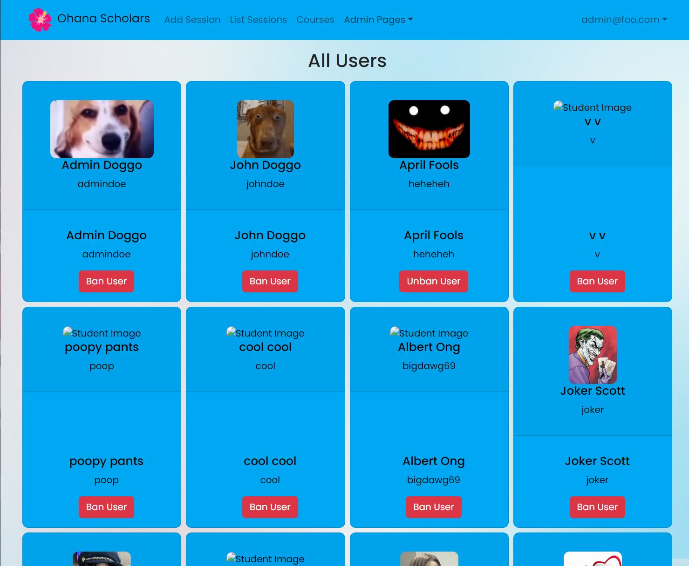

## What is It?

[Ohana Scholars](https://ohanascholars.org/) is a website made for students at the University of Hawaii at Manoa to schedule study sessions with each other. Students are able to make an account to join or create study sessions for the various courses at UH Manoa. It was developed by me, [Alden Paroni](https://aldenparoni.github.io/), [Audrey Soares](https://audreysoares.github.io/), [Mark Burgess](https://crepesalot.github.io/), and [Tung Nguyen](https://tungxn.github.io/). It makes use of this template that utilizes Meteor, Bootstrap 5, React, and MongoDB.

## Contributions

  
  

I worked on various different parts of this project. I created the sessions and student collection for my group to work off of. I also worked on a filter component used in courses and sessions based on the subject a user selected. Additionally, I added a ban page for admins to use to ban and unban users.

## Lessons

Working on this project taught me that there are a lot of things I still don’t understand. When working on an issue, I often come up with a solution in my head; however, when it comes to actually implementing it, I always come up blank. It’s made me realize that I need a lot more practice in implementing various things so I have practical experience in the future.

[Here is the project page for Ohana Scholars](https://ohana-scholars.github.io/).
