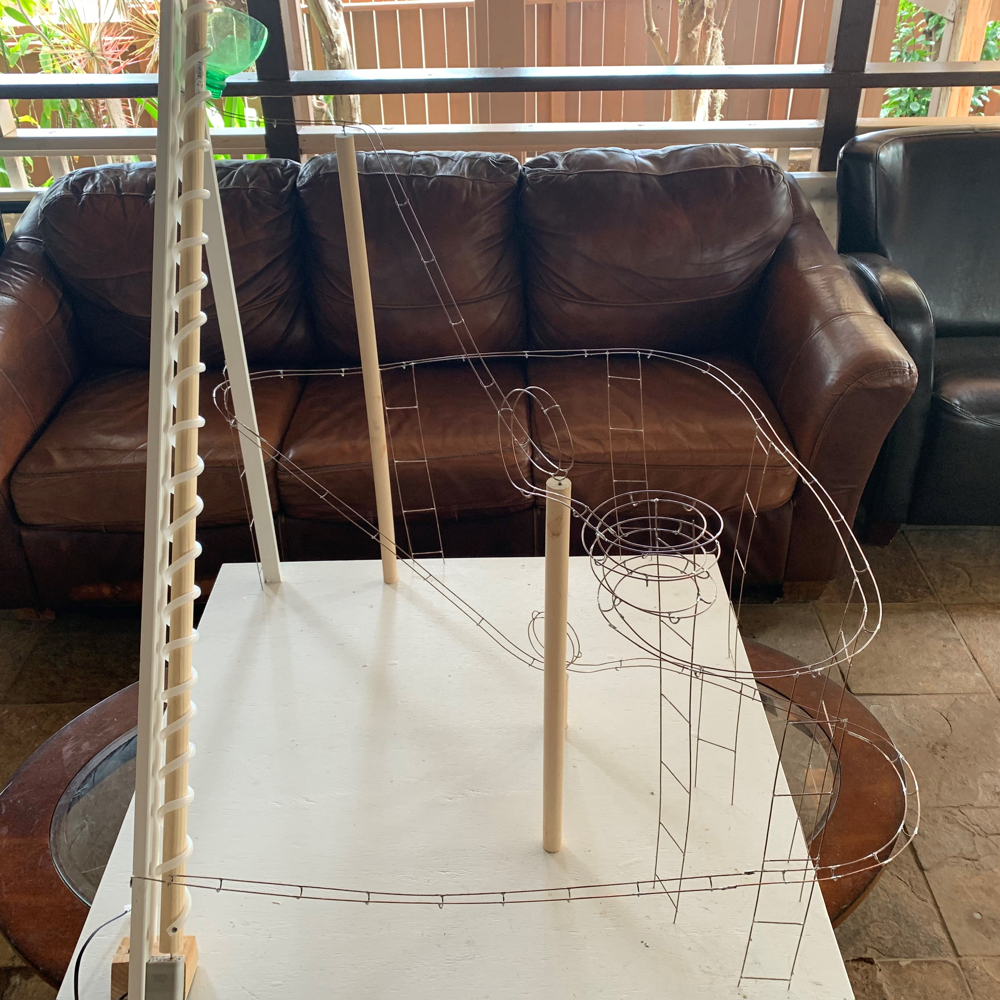
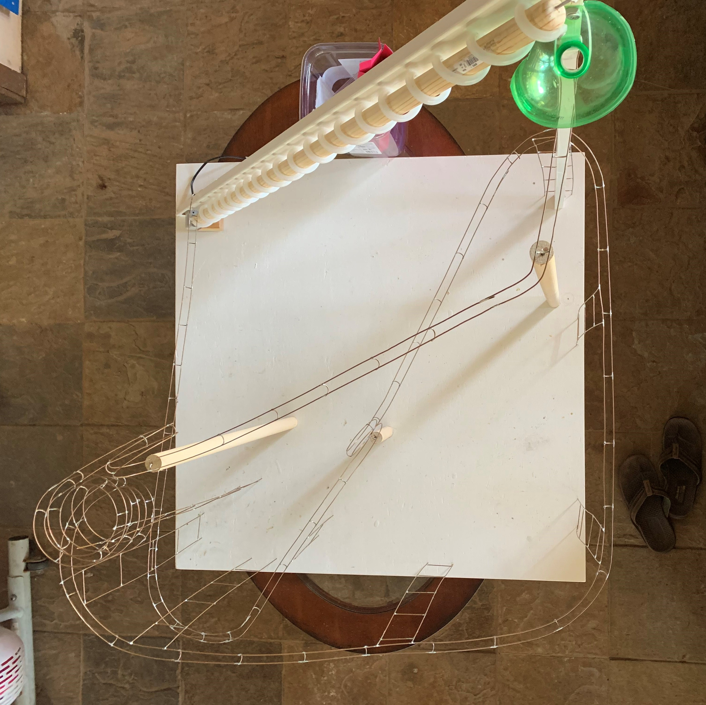

  
  

STEM is an acronym stands for Science, Technology, Engineering, and Mathematics. In the Spring of 2021, my STEM teacher told us to design and create a marble rollercoaster. The only limitation we were given were size constraints, it could only be 4 feet in terms of width, height, and depth. Not wanting to submit a boring project, I scoured the internet for ideas.

One idea that particularly caught my attention was a mable rollercoaster made of steel. However, since steel is too expensive of a material and I didn't even know where I could buy plenty of steel wire, I used the ground wire of an old electrical wire. The copper wire made for a perfect alternative as it was as malleable as steel. With materials set and an idea in mind, I started created a CAD model. The first CAD model I created had 2 loops, 1 spiral, numerous turns and a rotating elevator to bring the marble back to the top.

With my uncle's help we created the tracks by soldering the copper wires together. Once we started building, we immediately had a problem. Due to the size contraints, there was limited amount of elevation to create enough kinetic energy for the marble to keep rolling. The inital loop at the start had shaved off a little less than half of the max height. Once we reached the loop at the end, we had about 1 foot of height left. Through numerous mental maths and trial and error, we found the sweet spot for the marble to complete the loop with a little extra kinetic energy left over. With that extra kinetic energy we elevated the track again at just the right height so it could reach the next slope and roll right into the elevator.

Reflecting back on the project it taught me a lot about persistence. The final loop in the project had taken a significant time to flesh out. At one point I considered skipping the loop altogether. However, not adding that loop would've made my project feel incomplete and I kept my brain working until I could finally come up with a solution.
